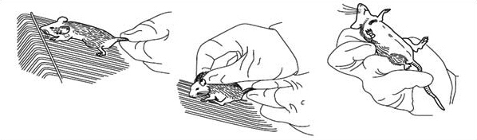

## Principle

&nbsp;

This section describes the use of rodents - how to handle them, manually restrain them, how to inject the experimental animals. For the safety of the handler and the animal, proper methods for handling and restraining laboratory animals should be followed. Many animal facilities provide training in handling techniques to enable the inexperienced handler to gain confidence and skill. Improper handling can result in increased stress and injury to the animal. In addition, the handler risks injury from bite wounds or scratches inflicted when the animal becomes fearful or anxious. By using sure, direct movements with a determined attitude, the animal can be easily handled and restrained. It should be remembered that mice will always try to bite the operator, proper restraint of a mouse is important for further manipulation. To properly restrain a mouse, pick it up by the base of the tail with your right hand and place it on the top of a wire cage lid, pull gently back on the tail, which will ensure the mouse to grasp the bars of the cage lid with all four feet. Then using the thumb and index finger of the left hand, quickly grasp the mouse by the scruff near the base of the head. When the scruff (the back of the neck) is firmly held, lift the mouse and press the tail base with third or fourth finger against the palm. Always remember to wear disposable gloves when you get involved in these lab activities.

&nbsp;

&nbsp;

Parenteral preparations are sterile preparations intended for administration by injection, infusion or implantation into the human or animal body. Parenteral preparations may require the use of excipients, for example to make the preparation isotonic with blood, to adjust the pH, to increase solubility, to prevent deterioration of the active substances or to provide adequate antimicrobial properties but not to adversely affect the intended medicinal action of the preparation or, at the concentrations used, to cause toxicity or undue local irritation. Parenteral preparations are supplied in glass containers or in other containers such as plastic containers and prefilled syringes. The tightness of the container is ensured by suitable means. Closures ensure a good seal, prevent the access of microorganisms and other contaminants and usually permit the withdrawal of a part or the whole of the contents without removal of the closure. The plastic materials or elastomers of which the closure is composed are sufficiently firm and elastic to allow the passage of a needle with the least possible shedding of particles. Closures for multidose containers are sufficiently elastic to ensure that the puncture is resealed when the needle is withdrawn. Parenteral injections include intramuscular (IM), intradermal (ID), intravenous (IV), intraperitoneal (IP), and subcutaneous (SQ), as well as intrathymic (IT) and footpad routes. The use of proper restraints and injection techniques will minimize the animal's pain and distress, and ensure successful substance administration. Hands-on training with an experienced individual should be sought before attempting any of these procedures for the first time. Further experience will be necessary before the techniques are mastered and results are consistent and predictable.

&nbsp;
 

### Types of Parenteral Injections
 

&nbsp;

**a) Intramuscular Injection**
 

&nbsp;

&nbsp;

This route is usually not used and is not recommended because of the small muscle mass available and the danger of damaging vital structures. However, when it is used, the back and hind leg muscles (caudal thigh muscles) are the usual sites selected. In this form of injection, the needle goes into the muscle layer under the skin. Restrain a mouse manually with the hind limbs immobilized, scrub the skin with alcohol, insert a small gauge (25-gauge or smaller) needle attached to a syringe into the muscle through the skin, slightly pull back the plunger of the syringe to ensure no vessels have been entered, press down on the plunger to deliver the material. Insert the needle into the muscle mass at a 90 degree angle. It is imperative that the mouse be properly restrained. If the mouse is allowed to kick or struggle, this could cause injury to the muscles or the nerve.

 
&nbsp;

**b) Intradermal Injection**
 

&nbsp;

&nbsp;

In order to perform intradermal injections, the mouse should be anesthetized. Shave or pluck an injection site on the back of the animal to remove the hair. Swab the site with 70% ethanol. Insert the needle into the skin, bevel up, holding the needle nearly parallel to the plane of the skin. Do not aspirate. Inject the material. The volume of the injection should be limited to 50 μl per site to avoid tissue trauma. A properly performed intradermal injection will result in a small, round skin welt.

&nbsp;
 
   

**c) Subcutaneous Injection**

&nbsp;

&nbsp;

This route is frequently used as an alternative to intramuscular injections in the mouse. The site usually chosen is the loose skin between the shoulder blades. Restrain the mouse by the scruff method. Use your thumb and forefinger to make a tent of skin over the scruff. Prep the area with 70% ethanol. Insert the needle, bevel up, at the base of the tent. The needle should be inserted parallel to the skin and should be directed toward the posterior of the animal. Aspirate to ensure proper placement and inject the material.

&nbsp;

 
**d) Intravenous Injection**
 

&nbsp;

&nbsp;

The IV injection has been widely used for drug, etc. Tail veins of the mouse are most commonly used for intravenous injection. They are readily visible especially after alcohol cleans the skin. Warming a mouse by putting it under heating light or warming its tail directly by soaking it in hot water (40-45oC) will dilate the veins to facilitate the injection (increases blood circulation). To perform the procedure, place the mouse in a mouse restrainer, disinfect the tail with 70% ethanol, hold the tail firmly, insert a small-gauge (25-gauge or smaller, attached to a syringe) needle with its bevel up through the skin and into the lumen of the vein, advance the tip in the vein about half centimetre to ensure it not to slide out of the vein, push the plunger of the syringe slowly and smoothly (You should be able to see the vein blanch if the needle is properly positioned). If the insertion of the needle into the vein is successful, there should be no resistance felt as the material is given, and the blood in the vein can be seen to be washed away. If any swelling at the injection site or resistance to injection occurs, remove the needle and reinsert it slightly above the initial injection site. Retract the needle and apply pressure to the injection site to ensure hemostasis.

 

Intravenous injection of the mouse is a difficult procedure which requires practice and patience. The inexperienced investigator should take the trouble to gain this skill in several practice sessions with phosphate-buffered saline (PBS) as the injectate.

&nbsp;
 

**e) Intraperitoneal Injection**

&nbsp;

&nbsp;

 

Intraperitoneal injection of rodents is the most commonly used procedure. It has been widely used for mouse anesthesia or drug administration. A mouse is manually restrained with the right hind limb immobilized and the head and body tilted downward. The right lower abdominal wall is disinfected with 70% ethanol. A 25 - gauge or smaller needle is quickly inserted into the peritoneal cavity in the caudal right abdominal quadrant through the skin and the abdominal wall, thereby avoiding injection into the cecum or the stomach on the left side. Aspirate gently to ensure that you are not in a blood vessel, urinary bladder or intestines. If you aspirate blood, bile, urine or other fluid, withdraw and apply pressure (change needle before re-injecting). Insert the needle into the abdomen between the midline and leg at a 45 degree angle. The needle tip is then lifted slightly and the material is delivered. Insert the needle at least half of its length (mice) or to the hub (rats). Inject the entire solution with as little movement as possible.

 
&nbsp;

**f) Footpad Injection**
 

&nbsp;

&nbsp;

Many protocols for the production of T cell lines and clones in mice and rats require footpad injection, which is usually done in only one or two footpads to minimize discomfort. This procedure is also chosen at times when allergic responses of an agent are desired to be studied.  Disinfect the skin over a footpad with 70% ethanol. Insert Gauge needle subcutaneously into the footpad area from the ventral side. Inject up to 50 μl of the material into subcutis in the footpad area. Retract the needle. Place a cotton ball over the injection site for about 1 min to prevent bleeding and spillage of material.

 
 

&nbsp;

**g) Intrathymic Injection**

&nbsp;

&nbsp;

The thymus is one of the lymphoid organs very commonly used in studies regarding Lymphocytes, etc. Like the organs like spleen, lymph nodes, etc; thymus is also used to isolate lymphocytes from an organism; thus having an important role in studies related to understanding the basic immunologic responses occurring in an organism under the test condition. Thus they are of application at the Cellular, as well as Molecular level of research.

&nbsp;

&nbsp;

